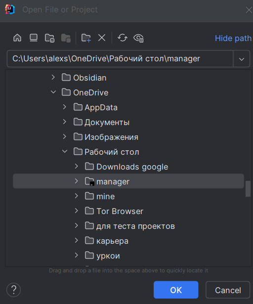

## Инструкция по локальному запуску проекта
***

### Разархивация проекта:

1) Скачайте архив проекта с GitHub и распакуйте его в папку с вашими проектами:

2) Откройте папку через IntelliJ IDEA:

3) Довертесь проекту:

### Для работы необходимо скачать Docker Desktop

1) Скачайте его и убедитесь в работоспособности:

2) Запустите контейнеры через docker-compose.yml:

3) Убедитесь в работоспособности контейнеров чезер Docker desktop:

### Подключение к базе данных

1) Выполните подключение к базе данных через IntelliJ IDEA:

2) Подключитесь. В нашем тестовом примере работа с БД идет:
на порту 5433, user: postgres, password: password, database: manager_db.
Проверте успешность подлючения (Test connection) и нажмите apply -> OK

### Запуск проекта. И его использование
 
1) Запустите проект:

2) Изучайте его при помощи Swagger UI или Postman (Если используйте web версию Postman, не забудьте установить Postman Agent и запустить его):

